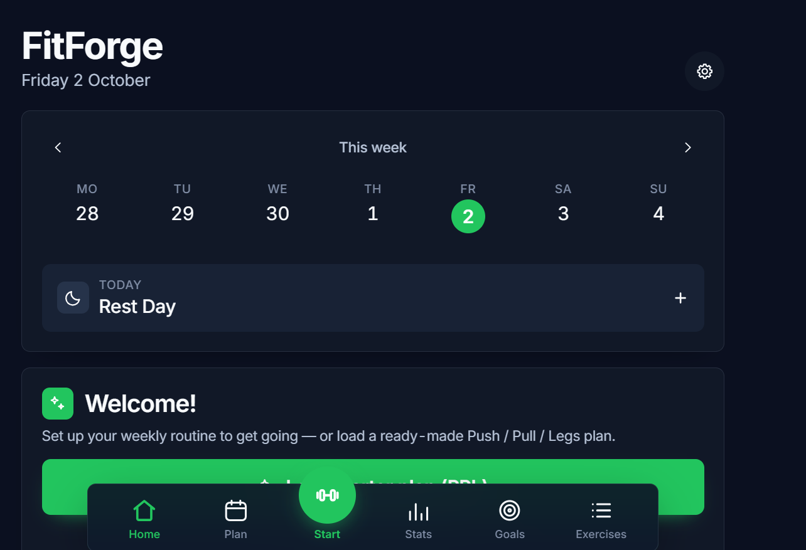
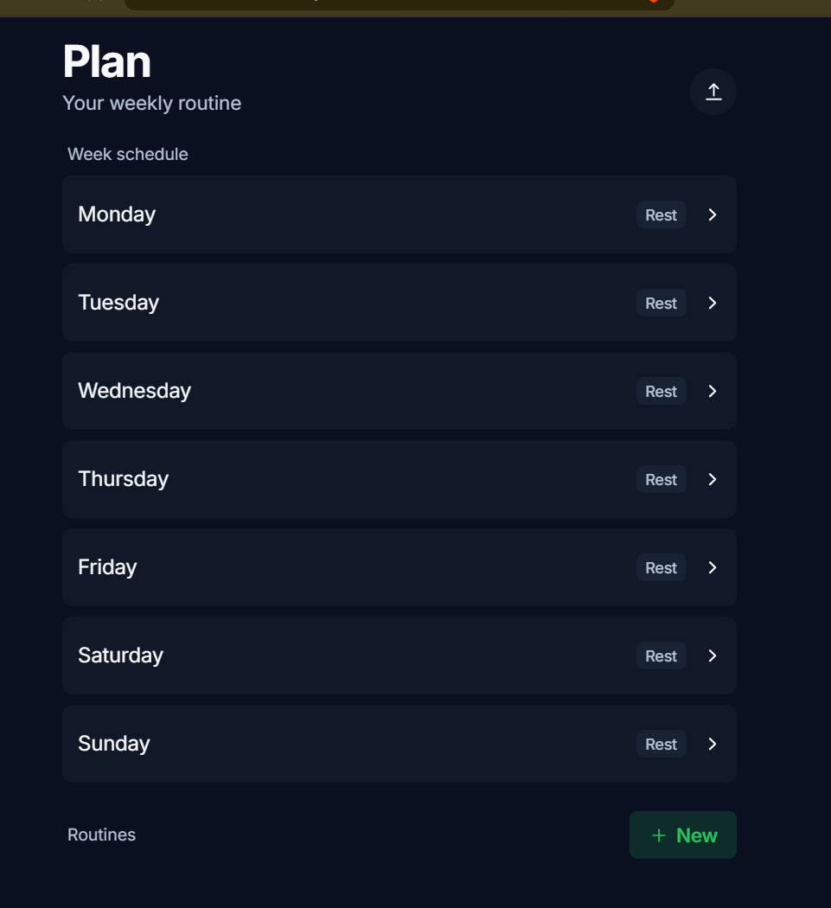
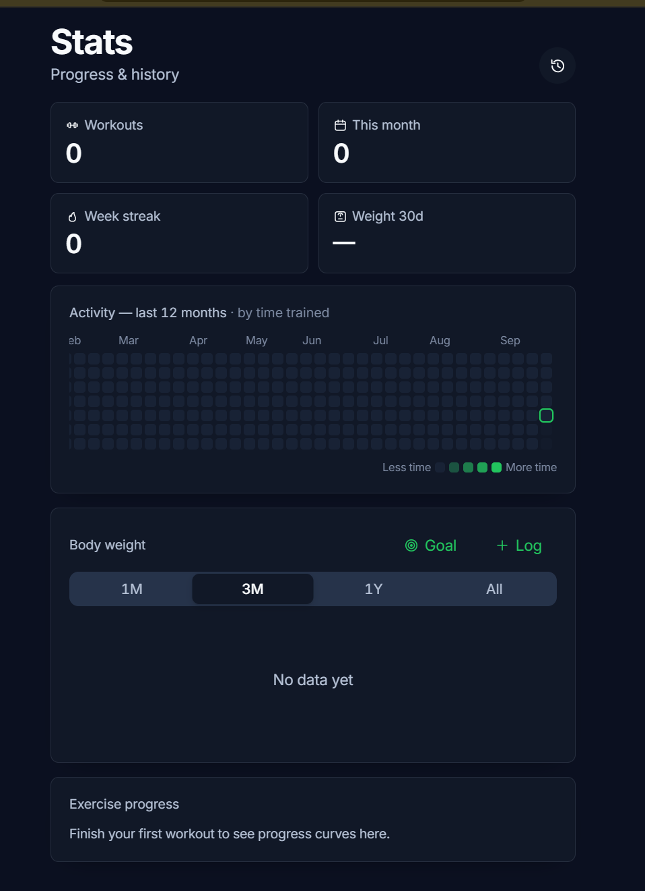

<div align="center">

### **FitForge**

<br>

### **A modern fitness tracker built around your training, progress, and goals.**

Plan your week, run guided workouts, track every set and your body weight over time —
then turn your progress into measurable goals you can actually follow.

<br>

[](LICENSE)


<br>

[](https://github.com/0902kishan/fitforge/commits/main)
[](https://github.com/0902kishan/fitforge/stargazers)
[](https://github.com/0902kishan/fitforge/issues)

</div>

<br>

<div align="center">
<table>
<tr>
<td align="center">
<br>
<sub><b>Home</b> — daily training & body weight</sub>
</td>
<td align="center">
<br>
<sub><b>Plan</b> — weekly routine scheduling</sub>
</td>
<td align="center">
<br>
<sub><b>Goals</b> — targets & progress tracking</sub>
</td>
<td align="center">
<br>
<sub><b>Stats</b> — history, charts & PRs</sub>
</td>
</tr>
</table>
</div>

<br>

<div align="center">

### **Train. Track. Improve.**

FitForge combines structured workouts, training history, body-weight tracking, and a dedicated Goals workspace in one interface.

</div>

---

## Why

Fitness apps often make the simple parts harder than they need to be.

FitForge keeps the training flow focused:

**plan → train → record → measure → improve**

The interface is designed to make important information visible without turning every action into another configuration screen.

---

## Features

- ⚖️ **Body-weight tracking** — record body weight over time and review historical changes with a chart and optional target
- 🏋️ **Weekly planning** — organize routines across the week and reschedule sessions when plans change
- ▶️ **Guided workouts** — run the planned session with pre-filled weights, set logging, rest timers and PR detection
- 🔗 **Supersets** — build paired movements and train them back-to-back
- ⏱️ **Timed exercises** — track movements such as planks, hangs, wall sits and loaded carries by time
- 📈 **Progression rules** — use structured progression approaches already available in the training system
- 💪 **Estimated 1RM** — estimate one-rep max from eligible training sets and review its progression
- 🎯 **Effort per set** — optional RIR/RPE tracking
- ↔️ **Reps per side** — support unilateral movements with side-aware targets
- 🏃 **Cardio** — log time and speed alongside training
- 🔧 **Equipment filtering** — narrow the exercise library to the equipment you actually use
- ✨ **Custom exercises** — create exercises that are not already in the built-in library
- 🟩 **Activity heatmap** — review training consistency across the year
- 💪 **Muscle map** — inspect training distribution across muscle groups
- 📤 **Import & export** — move supported training data and maintain portable backups
- 🔑 **Passkeys / WebAuthn** — supported by the self-hosted application
- 📱 **PWA & Capacitor** — use the application on the web or build it for mobile
- 🐳 **Docker Compose** — run the self-hosted stack with the existing container setup
- 🚫 **No telemetry** — designed around a no-tracking workflow

### 🎯 Goals workspace

- 🎯 **Dedicated Goals page** — separate goals from normal workout setup
- 💪 **Strength goals** — enter an exercise name, current capacity, target capacity and optional sets
- ⚖️ **Bodyweight goals** — set a body-weight target using tracked body-weight data
- 🗓️ **Frequency goals** — set a target number of workouts per week
- ✨ **Custom goals** — track another measurable target with your own unit
- 📌 **Goal cards** — see type, values and progress at a glance
- 📄 **Goal detail pages** — dedicated workspace for reviewing a goal
- 📝 **Goal check-ins** — keep lightweight progress history for goal-specific tracking
- 🔄 **Goal lifecycle** — organize goals as active, completed or archived
- 🧩 **Independent strength-goal data** — strength goals use a simple user-entered exercise name instead of forcing users through the full exercise library

---

## What changed in FitForge

FitForge keeps the underlying application's core training architecture while adding a new product layer focused on its visual identity and goal experience.

### Visual & branding

- 🎨 **FitForge branding** throughout the user-facing application
- 🟣 **New violet/cyan visual direction**
- 🌓 **Refined dark/light theme styling**
- 🔤 **Inter-based typography**
- 🧱 **Updated cards, tabs, buttons, sheets and empty states**
- 📱 **Updated application-facing metadata and branding**

### Goals

- 🎯 **New Goals navigation**
- 📋 **Active / Completed / Archived goal sections**
- 🪪 **Goal cards**
- 📄 **Goal detail route**
- ➕ **Goal creation flows**
- 💪 **Strength, Bodyweight, Frequency and Custom goals**
- 📝 **Goal-specific check-in storage**
- 💾 **Persistent goals inside the existing application state**
- 🧭 **Standalone Strength Goal exercise-name input**
- 🗂️ **Goal lifecycle controls**

The Goals feature is intentionally kept separate from the normal exercise-selection experience so that creating a strength target remains quick and simple.

---

## Goal flow

```text
                    ┌───────────────────┐
                    │     Add Goal      │
                    └─────────┬─────────┘
                              │
             ┌────────────────┼────────────────┐
             │                │                │
          Strength         Bodyweight       Frequency
             │                │                │
             └────────────────┼────────────────┘
                              │
                           Custom
                              │
                              ▼
                    ┌───────────────────┐
                    │   Goal Detail     │
                    │                   │
                    │ Start             │
                    │ Current           │
                    │ Target            │
                    │ Progress          │
                    │ Check-ins         │
                    └───────────────────┘
```

---

## Quick start

### Frontend development

```bash
cd frontend
npm install
npm run dev
```

### Run tests

```bash
cd frontend
npm test
```

### Production build

```bash
cd frontend
npm run build
```

---

## Docker

The project retains the existing Docker Compose deployment.

```bash
docker compose up -d --build
```

See [`docs/SELF_HOSTING.md`](docs/SELF_HOSTING.md) for self-hosted configuration, passkey/HTTPS setup, backups and notifications.

---

## Mobile

The codebase supports:

- **Web**
- **PWA**
- **Capacitor mobile builds**

See [`docs/MOBILE.md`](docs/MOBILE.md) for platform-specific build instructions.

---

## How it works

```text
             ┌──────────────────────────┐
             │         FitForge         │
             │      React + Vite        │
             └────────────┬─────────────┘
                          │
          ┌───────────────┼────────────────┐
          │               │                │
       Workout         History           Goals
          │               │                │
          └───────────────┼────────────────┘
                          │
                    Zustand State
                          │
                ┌─────────┴─────────┐
                │                   │
             Local              Self-hosted
           Persistence          Deployment
```

The frontend is organized around reusable React components, Zustand state, pure logic modules, and the existing sheet/navigation patterns.

---

## Project structure

```text
fitforge/
├── frontend/
│   ├── src/
│   │   ├── components/
│   │   ├── lib/
│   │   ├── store/
│   │   ├── views/
│   │   ├── sheets.jsx
│   │   └── App.jsx
│   └── package.json
│
├── api/
├── web/
├── docker-compose.yml
├── LICENSE
├── NOTICE.md
└── README.md
```

### Main areas

| Path | Purpose |
|---|---|
| `frontend/src/views/` | Main application screens |
| `frontend/src/components/` | Reusable UI |
| `frontend/src/lib/` | Training, history and goal logic |
| `frontend/src/store/` | Persistent and UI state |
| `frontend/src/sheets.jsx` | Sheet/modal interactions |
| `api/` | Backend services |
| `web/` | Web/nginx container configuration |

---

## Data philosophy

FitForge keeps the application's state model lightweight.

Goals store the information the user intentionally defines and use dedicated goal check-ins where historical progress needs to be recorded.

The design avoids copying the entire workout history into the Goals system just to display a goal.

---

## Development

The project favors:

- existing architecture over parallel systems
- reusable UI components
- Zustand for state
- pure functions for calculations
- small persistent records
- tests alongside logic
- minimal additional dependencies

The Goals workspace follows the same principles. Run `npm test` from `frontend/` for the unit tests, and `node scripts/check-locales.mjs` from `frontend/` to verify translation key parity.

---

## Roadmap

### Goals

- [x] Goals navigation
- [x] Active / Completed / Archived sections
- [x] Strength goals
- [x] Bodyweight goals
- [x] Frequency goals
- [x] Custom goals
- [x] Goal cards
- [x] Goal detail pages
- [x] Goal-specific check-ins
- [x] Independent Strength Goal exercise-name entry
- [ ] Rich graphical goal analysis
- [ ] Trend analysis
- [ ] Progressive-overload analysis
- [ ] Decline / regression insights
- [ ] Milestones and achievement summaries
- [ ] Goal tasks
- [ ] External evidence links

---

## License & notices

This project retains the applicable licensing and third-party notices shipped with the repository.
FitForge is derived from the open-source **openGym** project; upstream copyright and third-party
attribution (including the exercise dataset terms) are preserved in the files below.

See:

- [`LICENSE`](LICENSE)
- [`NOTICE.md`](NOTICE.md)

for the complete license and third-party information.

---

<div align="center">

### **FitForge**

**Train. Track. Improve.**

</div>


